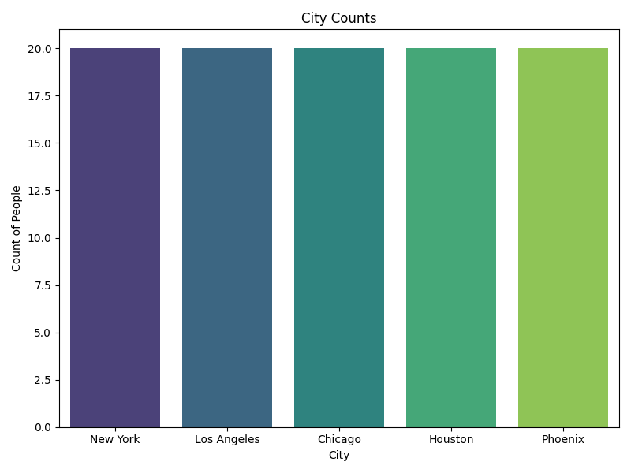
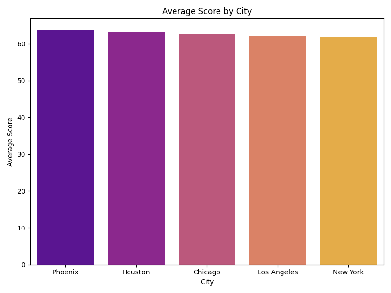
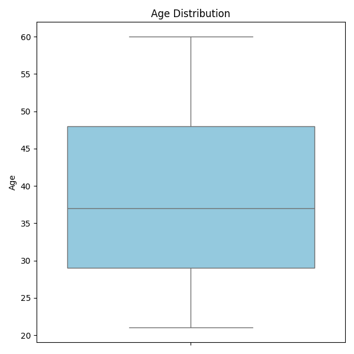
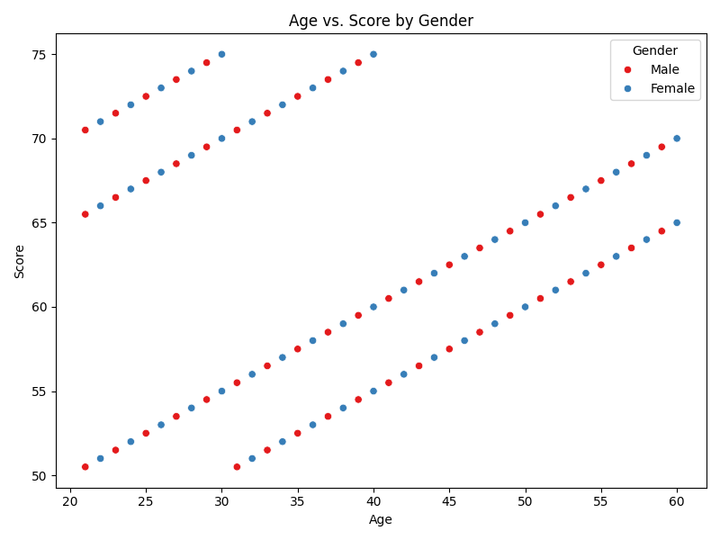
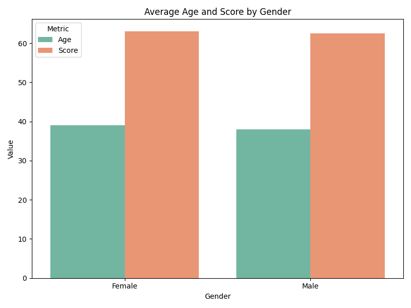

# Vizit

Vizit is an AI-driven data visualization pipeline that leverages [Orion](https://github.com/AshishKumar4/Orion) agents and OpenAI’s language models to automatically ingest, preprocess, analyze, and visualize your data. With Vizit, you can transform raw datasets into beautiful, insightful visualizations with minimal manual intervention.

---

## Table of Contents

- [Features](#features)
- [Architecture Overview](#architecture-overview)
- [Installation](#installation)
- [Usage](#usage)
  - [Command Line Interface (CLI)](#command-line-interface-cli)
  - [Example Workflow](#example-workflow)
- [Example Output](#example-output)
- [Visualization Examples](#visualization-examples)
- [Configuration](#configuration)
- [Extending Vizit](#extending-vizit)
- [Contributing](#contributing)
- [License](#license)

---

## Features

- **Data Ingestion:**  
  Load datasets (CSV, Excel, JSON) into a Pandas DataFrame.
  
- **Automated Preprocessing:**  
  An Orion agent generates and executes Python code to clean or transform your data.

- **Data Analysis:**  
  A dedicated stage where an Orion agent generates and executes code to compute summary statistics and derive additional metrics. All outputs are retained in a persistent execution context.

- **Visualization Suggestion:**  
  An Orion agent examines a summary of the analyzed data and returns textual recommendations for meaningful plots.

- **Visualization Code Generation:**  
  A final Orion agent generates Python code to create the recommended visualizations (using Plotly, matplotlib, or seaborn) and executes the code to save the plots as PNG files.

- **Persistent Execution Context:**  
  A custom `CodeExecutor` maintains a persistent namespace that carries over variables (including the DataFrame and any newly created summaries) between code executions.

- **Retry Mechanism:**  
  If generated code errors out, the agent is notified with the error details and asked to regenerate its code.

- **Modular & Object-Oriented:**  
  Each pipeline stage is encapsulated in its own module for easy extension and maintenance.

---

## Architecture Overview

Vizit’s pipeline consists of the following stages:

1. **Ingestion:**  
   Reads your dataset from a file and loads it into a DataFrame.

2. **Preprocessing:**  
   An Orion agent receives a summary of the data and generates Python code to clean/transform it.  
   Code is executed using the persistent `CodeExecutor`.

3. **Data Analysis:**  
   Another Orion agent generates code to compute summary statistics and other derived metrics.  
   Results (new variables, insights, etc.) are stored persistently for later stages.

4. **Visualization Suggestion:**  
   Based on the analyzed data summary, an Orion agent suggests 2–4 meaningful visualizations in text form.

5. **Visualization Code Generation:**  
   Finally, an Orion agent produces Python code that generates the visualizations and saves them as PNG files in a specified output folder.  
   The persistent context is used so that any variables created earlier are available to this agent.

*Note: Each stage creates its dedicated Orion agent and directly integrates with the persistent `CodeExecutor`. There is no global data store; instead, the `CodeExecutor` object is passed among stages.*

---

## Installation

Vizit requires Python 3.8 or higher. To install Vizit, clone the repository and install it in editable mode:

```bash
git clone https://github.com/yourusername/vizit.git
cd vizit
pip install -e .
```

Dependencies (including Orion, pandas, openai, plotly, etc.) are specified in the `pyproject.toml` file.

---

## Usage

### Command Line Interface (CLI)

Vizit includes a simple CLI tool to run the complete pipeline. For example, to run the pipeline on your dataset:

```bash
python3 cli.py --data test.csv --output output
```

- **--data:** Path to your dataset (CSV, Excel, or JSON).
- **--output:** Directory where generated visualization files will be saved (Vizit will create this directory if it doesn’t exist).

### Example Workflow

1. **Data Ingestion:**  
   The pipeline reads your dataset (e.g., `test.csv` with 100 rows and 6 columns) and loads it into a DataFrame.

2. **Preprocessing Stage:**  
   The preprocessing agent analyzes the initial summary of the DataFrame and generates code (e.g., to drop duplicates, trim whitespace, and ensure correct data types).  
   The generated code is executed, and any errors are reported and retried.

3. **Data Analysis Stage:**  
   An analysis agent generates code to compute statistics such as descriptive stats, counts, group-wise averages, correlations, and other insights.  
   The persistent context stores the results for future use.

4. **Visualization Suggestion Stage:**  
   Based on the updated DataFrame summary, the visualization suggestion agent provides recommendations like:
   - "Bar chart of City counts"
   - "Box plot of Age distribution"
   - "Scatter plot of Age vs. Score, colored by Gender"
   - "Grouped bar chart comparing average Age and Score by Gender"

5. **Visualization Code Generation Stage:**  
   Finally, the visualization code agent generates and executes code that creates the plots and saves them as PNG files in the specified output folder.

---

## Example Output

Below is an example of what running the pipeline might look like on the command line (logged output):

```plaintext
(torch) (base) mrwhite0racle@White0racle:~/Desktop/SaumyaCourses/Vizit$ python3 cli.py --data test.csv --output output > test.log
2025-02-17 18:26:53 [INFO] ... | Initial context summary: {
    "DataFrame": "Shape: (100, 6)\nColumns: ['ID', 'Name', 'Age', 'Gender', 'City', 'Score']\nHead:\n  1 Person1   21   Male    New York   50.5\n  2 Person2   22 Female Los Angeles   51.0\n  3 Person3   23   Male     Chicago   51.5\n  4 Person4   24 Female     Houston   52.0\n  5 Person5   25   Male     Phoenix   52.5"
}
2025-02-17 18:26:53 [INFO] ... | [Stage: Preprocessing]
...
2025-02-17 18:27:14 [INFO] ... | DataFrame summary after preprocessing: {
    "DataFrame": "Shape: (100, 6)\nColumns: ['ID', 'Name', 'Age', 'Gender', 'City', 'Score']\nHead:\n  1 Person1   21   Male    New York   50.5\n  2 Person2   22 Female Los Angeles   51.0\n  ...",
    "col": "Type: <class 'str'>, Value: City"
}
2025-02-17 18:27:30 [INFO] ... | [Stage: Analysis]
...
2025-02-17 18:27:44 [INFO] ... | [Stage: Visualization Suggestion]
...
2025-02-17 18:28:10 [INFO] ... | [Stage: Visualization Code Generation]
2025-02-17 18:28:11 [INFO] ... | [INFO] Pipeline complete. Final DataFrame shape: (100, 6)
```

All generated output files (e.g., PNG plots) are saved in the `output` directory.

---

## Visualization Examples

After running the pipeline, you should see visualization files in your output folder. For example:

### 1. Bar Chart of City Counts



### 2. Bar Chart of Average Score by City



### 3. Box Plot of Age Distribution



### 4. Scatter Plot of Age vs. Score by Gender



### 5. Grouped Bar Chart of Gender Statistics



*Note: The above images are samples. Your generated visualizations may vary based on your dataset and agent outputs.*

---

## Configuration

Before running Vizit, set the following environment variables:

- **OPENAI_API_KEY:** Your OpenAI API key.
- **ORION_MODEL_NAME:** (Optional) The Orion model to use (default is `"gpt-4o"`).

For example:

```bash
export OPENAI_API_KEY="sk-..."
export ORION_MODEL_NAME="gpt-4o"
```

---

## Extending Vizit

Vizit is designed to be modular and extensible. Here are some ideas:

- **Web Interface:**  
  Build a Flask or FastAPI application to serve the pipeline results and display visualizations interactively.

- **Additional Analysis:**  
  Add specialized analysis agents to compute advanced metrics or machine learning insights.

- **Custom Agents:**  
  Enhance the Orion agents to support domain-specific preprocessing or visualization techniques.

- **Improved Logging & Error Handling:**  
  Integrate with logging or monitoring tools for production environments.

---

## Contributing

Contributions are welcome! Please fork the repository, create a new branch for your feature or bug fix, and submit a pull request.

1. Fork the repository.
2. Create a new branch (`git checkout -b feature/your-feature`).
3. Commit your changes.
4. Push your branch and open a pull request.

---

## License

This project is licensed under the MIT License. See the [LICENSE](LICENSE) file for details.

---

## Acknowledgments

- This project leverages the [Orion](https://github.com/AshishKumar4/Orion) library for agent-based interactions.
- Thanks to the contributors of OpenAI’s language models and the Python data science ecosystem for making projects like Vizit possible.
```

---

This `README.md` provides a thorough explanation of the library, how to use it, real example log output, and visualization examples. Adjust the paths and images as needed for your repository and environment.